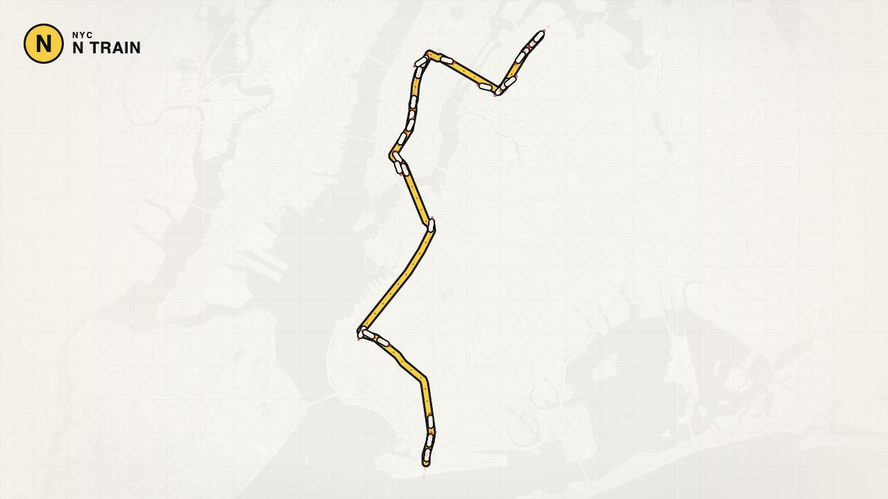

# NYC Broadway Express

A live map of every N train in New York City, placed on the real track from the
MTA's GTFS-Realtime feed.

## Live

[denizaa.com/nyc-broadway-express](https://denizaa.com/nyc-broadway-express/)

## Preview



## Run locally

```bash
node server.js       # http://localhost:4173
npm test             # position and network model checks
```

The first start downloads the MTA's static subway GTFS bundle (~5 MB), derives
the line model from it, and caches both under `.cache/`. The bundle is refreshed
weekly.

### Working without the live feed

```bash
node tools/mock-feed.js &
REALTIME_URL=http://127.0.0.1:4174/feed node server.js
```

The mock runs trains along the line's real stopping patterns and scheduled
running times, and publishes them the way the MTA does — only the stops still
ahead of each train — so the server's inference is exercised the same way.

## How a train gets on the map

The MTA does not publish coordinates. It publishes, per trip, the stops still
ahead of it and when it expects to reach them. Everything else is inference:

1. **The line is cut into links.** The N is not one line — it runs express over
   the Manhattan Bridge by day and local through the Montague tunnel and Lower
   Manhattan at night, with a few Second Avenue trips on top: fourteen stopping
   patterns over one corridor. Rather than pick one shape, every GTFS shape is
   cut at its stops into per-stop-pair links (112 of them), so a train is always
   on the track it is actually running.
2. **The stop ahead** is the first update whose departure is still in the future.
   Note that GTFS-Realtime's `stop_id` is the stop a train is heading *to*, never
   the one behind it.
3. **The stop behind** usually is not in the feed — the MTA prunes stops once
   they are passed — so it comes from the trip's stopping pattern, which the trip
   id carries in its suffix (`073250_N..N34R`).
4. **The departure time** is either published, remembered from the poll where the
   train was watched moving on, or estimated from the scheduled running time for
   that pair of stops. Once chosen it is held steady, so a revised arrival
   estimate never makes a train rubber-band backwards.

Position is then a pure function of those two timestamps and the clock. The
browser re-evaluates it every frame against a server-synchronised clock, which is
why the picture is identical in two tabs and survives a reload.

## What the speed means

Trains are drawn at the speed the feed implies — roughly 3 px every 20 seconds
at whole-line zoom, because the line is 35 km long. That is real, not a stall.
Zoom in, or select a train and follow it, to see it move.

## API

| Route | Purpose |
| --- | --- |
| `GET /api/network` | Stations, per-stop-pair track geometry, stopping patterns, line order |
| `GET /api/trains` | Live trains: link, bounding timestamps, remaining stops, server clock |
| `GET /api/health` | Feed age and error state |

## Data

* Static schedule and track geometry: [MTA GTFS](https://rrgtfsfeeds.s3.amazonaws.com/gtfs_subway.zip)
* Live positions: MTA GTFS-Realtime N/Q/R/W feed
* Basemap: CARTO Positron, Leaflet

No dependencies — the ZIP reader, CSV parser and protobuf decoder are in `src/`.
